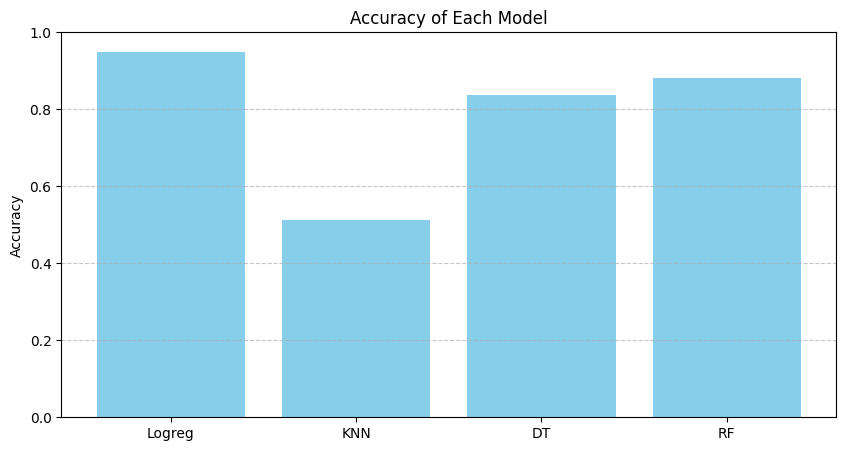
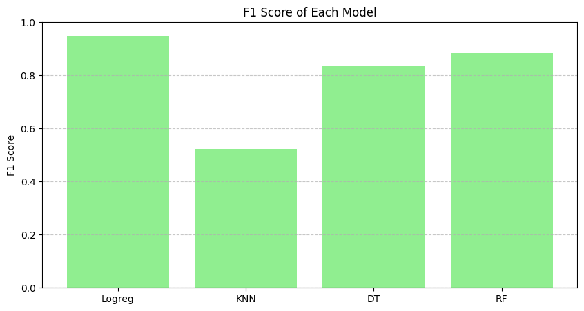
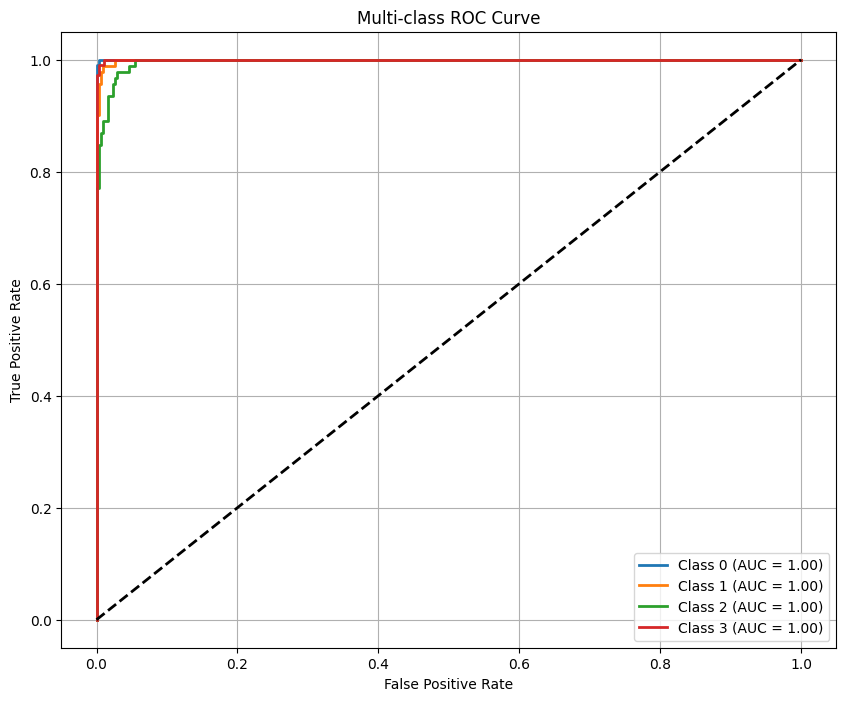

# Smartphone Price Prediction

This machine learning project aims to classify smartphones into different price categories based on their features using supervised classification models.

## 📁 Dataset

- **train.csv** — contains smartphone features and their corresponding `price_range` (target).
- **test.csv** — contains smartphone features only; used to predict price range.

## 🎯 Objective

To train and evaluate different classification models and identify the best performer for price prediction. The final predictions are exported and the model is saved for future use.

---

## 📊 Features Used

- Total Features: 20 (excluding `price_range`)
- Data scaled using `StandardScaler`

---

## 🧠 Models Evaluated

- Logistic Regression ✅ (best)
- K-Nearest Neighbors
- Decision Tree
- Random Forest

Each model was evaluated using:
- Accuracy
- F1 Score (weighted)
- Confusion Matrix
- ROC-AUC Curve (multi-class)

---

## 📈 Results

### 🔹 Accuracy Comparison

### 🔹 F1 Score Comparison

### 🔹 Confusion Matrix (Logistic Regression)

### 🔹 ROC Curve (Multiclass)

### 🔹 Confusion Matrix Comparison

This chart compares confusion matrices for all four models side-by-side.

---

## ✅ Final Model

- **Selected Model**: `LogisticRegression` (with GridSearchCV)
- **Best Parameters**: Automatically selected via cross-validation
- **Exported File**: `final_predictions.xlsx` (includes test set predictions)
- **Saved Model**: `final_model.pkl`

---

## 📤 How to Use

1. Upload `train.csv` and `test.csv`
2. Run the notebook
3. The script:
    - Trains models
    - Evaluates performance
    - Selects the best model
    - Saves predictions to Excel
    - Saves the trained model using `joblib`

---

## 📎 Dependencies

- pandas
- numpy
- scikit-learn
- matplotlib
- seaborn (optional for nicer plots)
- openpyxl (for Excel export)
- joblib

---

## ✍️ Author

Ahmed Farhat

---

> 🔁 Feel free to fork this project and improve it!
